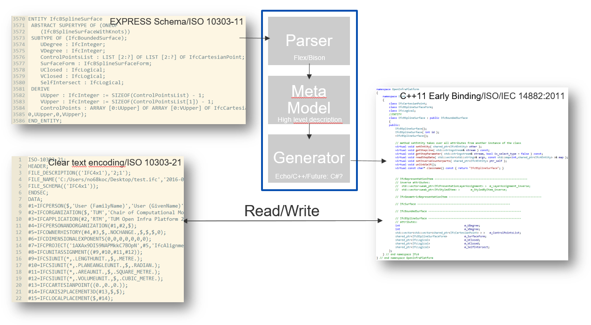

# TUM Open Infra Platform Early Binding EXPRESS Generator

## Info

TUM Open Infra Platform Early Binding EXPRESS Generator is a simple early binding generator for EXPRESS.

## Overview

## License

This file is part of TUM Open Infra Platform Early Binding EXPRESS 
Generator, a simple early binding generator for EXPRESS.
Copyright (c) 2016-2017 Technical University of Munich
Chair of Computational Modeling and Simulation.

TUM Open Infra Platform Early Binding EXPRESS Generator is free 
software; you can redistribute it and/or modify it under the terms 
of the GNU General Public License Version 3 as published by the Free
Software Foundation.

TUM Open Infra Platform Early Binding EXPRESS Generator is 
distributed in the hope that it will be useful, but WITHOUT ANY 
WARRANTY; without even the implied warranty of MERCHANTABILITY or 
FITNESS FOR A PARTICULAR PURPOSE. See the GNU General Public License
for more details.

You should have received a copy of the GNU General Public License
along with this program. If not, see <http://www.gnu.org/licenses/>.

## Copyright notes
TUM Open Infra Platform Early Binding EXPRESS Generator uses the following software libraries. The corresponding licenses can be found in the Licenses folder distributed with this source code:

* boost 1.63.0 (http://www.boost.org/) (*Boost Software License*) ({root_dir}/Licenses/boost.LICENSE_1_0.txt)
